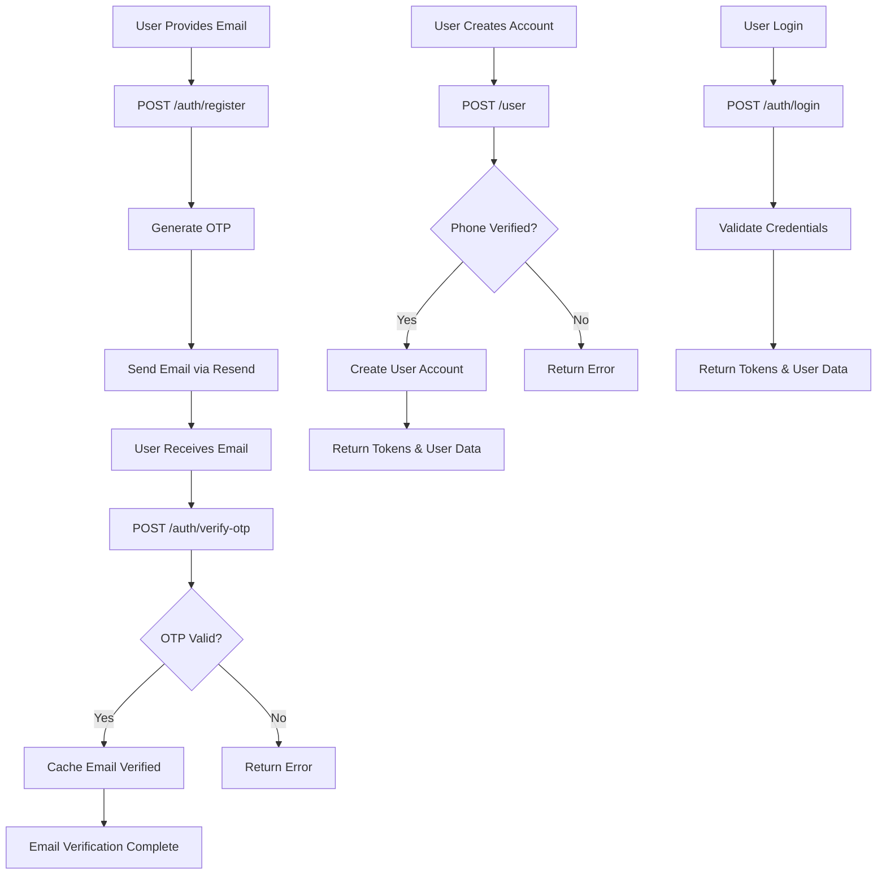

# Authentication Flow Update - Email OTP Implementation

This document describes the updated authentication system that now uses email-based OTP verification instead of phone-based OTP.

## Updated Authentication Flows

### 1. Email OTP Verification Flow (NEW)

**Endpoint:** `POST /auth/register`
- **Purpose:** Register with email and receive OTP
- **Input:** `{ "email": "user@example.com" }`
- **Process:** 
  - Validates email format
  - Checks if email already exists
  - Generates 6-digit OTP code
  - Sends OTP to email via Resend service
  - Returns success message

**Endpoint:** `POST /auth/verify-otp`
- **Purpose:** Verify the email OTP code
- **Input:** `{ "email": "user@example.com", "code": "123456" }`
- **Process:**
  - Validates email and OTP code
  - Verifies OTP against database
  - Caches email verification status in Redis (5 minutes)
  - Deletes used OTP from database

### 2. User Account Creation Flow (UNCHANGED)

**Endpoint:** `POST /user`
- **Purpose:** Create user account with phone number and password
- **Input:** `{ "phoneNumber": "01234567890", "password": "Password123" }`
- **Process:**
  - Validates phone number format and password strength
  - Checks if phone number verification exists in Redis cache
  - Creates user account if verification is valid

### 3. Login Flow (UNCHANGED)

**Endpoint:** `POST /auth/login`
- **Purpose:** Authenticate with phone number and password
- **Input:** `{ "phoneNumber": "01234567890", "password": "Password123" }`
- **Process:**
  - Validates credentials against database
  - Generates JWT tokens (auth + refresh)
  - Returns user data and tokens

## Technical Changes Made

### 1. Data Models
- **OTP Model:** Changed `phoneNumber` field to `email`
- **OTP Type:** Updated TypeScript interface
- **MongoDB Schema:** Updated field definition

### 2. Services
- **OTP Service:** Updated `create()` and `verify()` methods to use email
- **Email Service:** Already configured with Resend for sending OTP emails

### 3. Configuration
- **Redis Cache:** Added `emailVerified` cache configuration (5-minute TTL)
- **Redis Keys:** Added `emailVerified(email)` key function
- **TypeScript Types:** Updated Redis config interfaces

### 4. Controllers
- **Auth Controller:** 
  - `registerUser()`: Now works with email input
  - `verifyOTP()`: Fixed to use email verification
- **User Controller:** Maintained phone number verification check

### 5. API Documentation
- **Auth Endpoints:** Updated Swagger docs for email-based flow
- **User Endpoints:** Clarified phone number verification requirements
- **Examples:** Updated all examples to use appropriate data formats

## Current System Architecture



## Migration Notes

### Breaking Changes
- OTP registration now requires email instead of phone number
- OTP verification now requires email instead of phone number
- Database: Existing OTP records will need to be cleared (they expire in 60 seconds anyway)

### Non-Breaking Changes  
- User creation flow still uses phone numbers
- Login flow unchanged
- User profile management unchanged
- All existing user accounts remain functional

### Environment Variables Required
- `RESEND_API_KEY`: Required for sending OTP emails
- All existing Redis and MongoDB configurations remain the same

## Testing the Updated Flow

1. **Register with Email:**
   ```bash
   curl -X POST http://localhost:3000/auth/register \
     -H "Content-Type: application/json" \
     -d '{"email":"test@example.com"}'
   ```

2. **Verify OTP:**
   ```bash
   curl -X POST http://localhost:3000/auth/verify-otp \
     -H "Content-Type: application/json" \
     -d '{"email":"test@example.com","code":"123456"}'
   ```

3. **Create User Account:** (Still requires phone verification from separate process)
   ```bash
   curl -X POST http://localhost:3000/user \
     -H "Content-Type: application/json" \
     -d '{"phoneNumber":"01234567890","password":"Password123"}'
   ```

## Future Considerations

1. **Unify Verification Flows:** Consider updating user creation to also use email verification
2. **Passwordless Auth:** The email OTP system could be extended for passwordless login
3. **Multi-Factor Auth:** Email OTP could serve as a second factor for enhanced security
